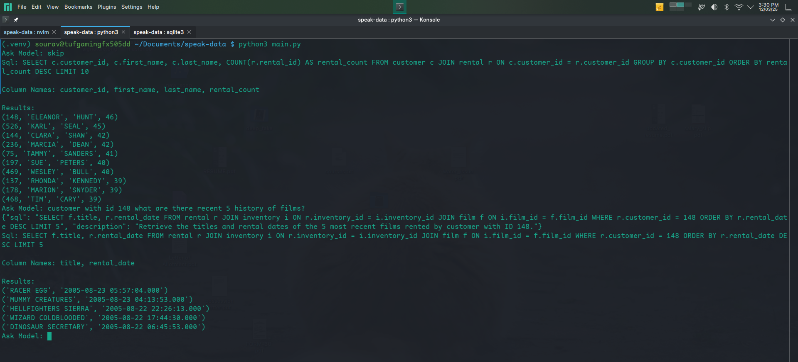

---

# LLM SQL Query Generator  

## Overview  
This project integrates a Large Language Model (LLM) on top of a relational database, allowing users to ask natural language questions about their database. The LLM generates corresponding SQL queries, which can then be executed to retrieve results.  

## Features  
- Converts natural language questions into SQL queries  
- Supports various relational databases (MySQL, PostgreSQL, etc.)  
- Helps users without SQL knowledge interact with databases easily  
- Provides explanations for generated queries  

## Installation  
1. Clone the repository, and create a virtual env  
2. Install dependencies:  
   ```bash
   pip install -r requirements.txt
   ```  
3. Set up database connection in the configuration file.  

## Usage  
Run the application:  
```bash
python main.py  
```  
Then, input your natural language question, and the system will generate the corresponding SQL query.  

## Example  
Input:  
> "Show me the total sales for each product in the last month."  

Generated SQL:  
```sql
SELECT * FROM ....
```  

## Screenshot  
  


---

